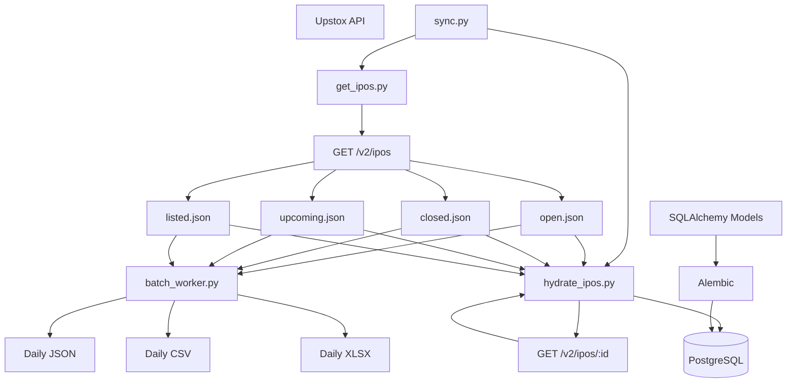
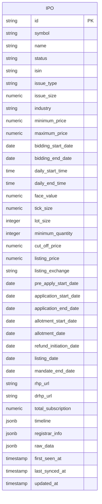
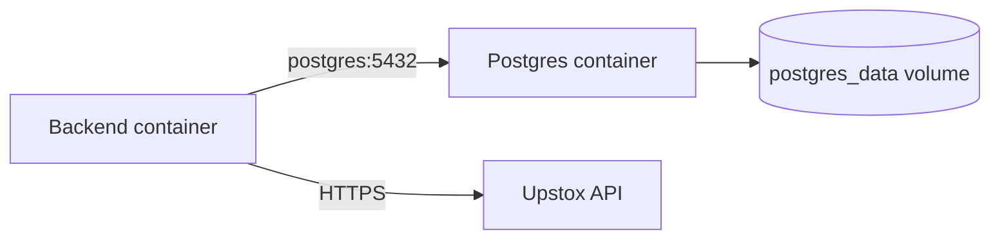
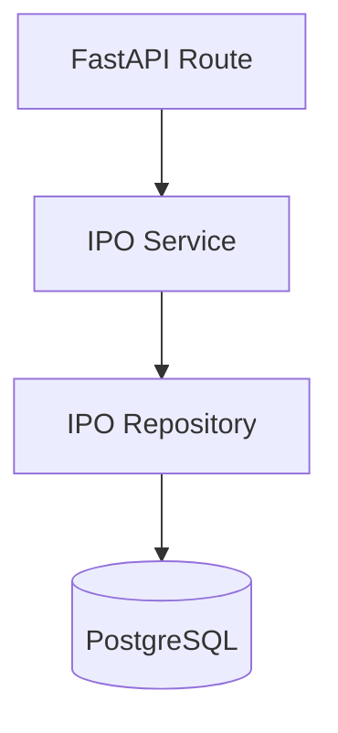
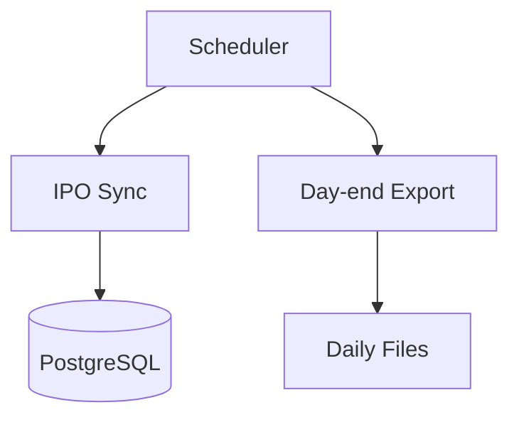
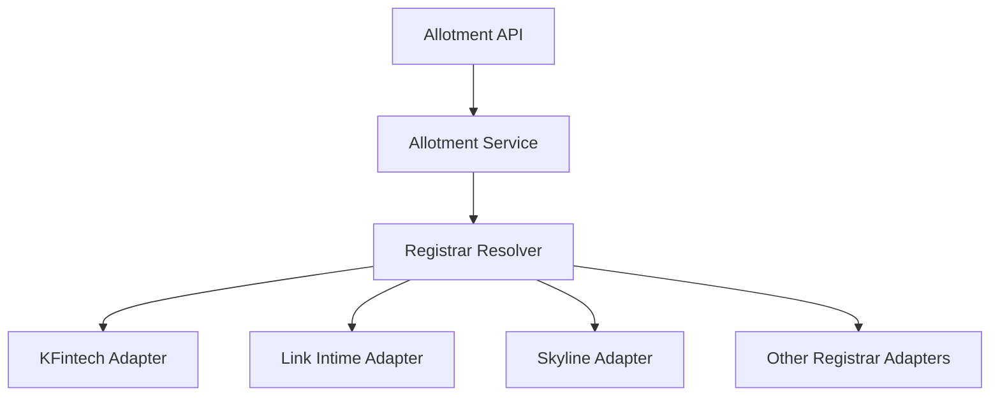
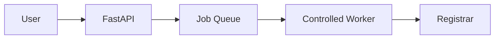
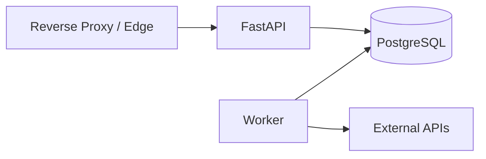

# Augur Backend

Augur is an IPO data and allotment-checking backend focused on collecting IPO information, normalizing it, storing it in PostgreSQL, and exposing it through an API.

The project is currently in the **data-ingestion and database foundation phase**. The next major phase is the API layer, followed by the registrar/allotment subsystem.

---

## Current Status

- [x] Upstox IPO list ingestion through `/v2/ipos`
- [x] Support for both `regular` and `sme` IPOs
- [x] Status-based staging:
  - `open.json`
  - `closed.json`
  - `upcoming.json`
  - `listed.json`
- [x] Full IPO hydration through `/v2/ipos/:id`
- [x] PostgreSQL database
- [x] SQLAlchemy ORM
- [x] Alembic migrations
- [x] UPSERT-based IPO persistence
- [x] Day-end JSON/CSV/XLSX export
- [x] Dockerized PostgreSQL + Python environment
- [x] Sequential `sync.py` pipeline
- [ ] FastAPI API layer
- [ ] API pagination/filtering/sorting
- [ ] Automated scheduled sync
- [ ] Registrar abstraction
- [ ] Allotment checker
- [ ] API authentication/rate limiting
- [ ] Automated tests and CI
- [ ] Production deployment

---

# Architecture

The current system intentionally separates **discovery**, **hydration**, and **storage**.



### Why the pipeline is split this way

- `/ipos` is the **discovery endpoint**.
  - It tells us which IPOs exist for each lifecycle status and issue type.
  - It is used to build the four local staging files.
- `/ipos/:id` is the **hydration endpoint**.
  - It provides the detailed IPO record.
  - The returned record is normalized and persisted in PostgreSQL.
- PostgreSQL is the **application source of truth**.
  - The JSON files are staging/snapshot artifacts, not the permanent database.
- The day-end batch worker produces human-friendly exports without changing the database.

This separation gives the project a clean debugging path: discovery, hydration, normalization, and persistence can each be checked independently.

---

# Project Structure

```text
backend/
├── app/
│   ├── database.py
│   └── models.py
│
├── ipos/
│   ├── open.json
│   ├── closed.json
│   ├── upcoming.json
│   └── listed.json
│
├── migrations/
│   ├── env.py
│   ├── script.py.mako
│   └── versions/
│
├── exports/
│   └── daily/
│       └── YYYY-MM-DD/
│           ├── ipos.json
│           ├── ipos.csv
│           └── ipos.xlsx
│
├── .dockerignore
├── .env
├── .env.docker
├── .env.example
├── alembic.ini
├── batch_worker.py
├── docker-compose.yml
├── Dockerfile
├── get_ipos.py
├── hydrate_ipos.py
├── requirements.txt
├── setup.sh
└── sync.py
```

### Important files

- `app/database.py`
  - SQLAlchemy engine and session configuration.
  - Reads database configuration from environment variables.
- `app/models.py`
  - Defines the PostgreSQL schema through SQLAlchemy.
- `get_ipos.py`
  - Calls Upstox `/ipos`.
  - Handles status + issue-type combinations.
  - Handles pagination.
  - Writes the four JSON staging files.
- `hydrate_ipos.py`
  - Reads the four JSON files.
  - Collects unique IPO IDs.
  - Calls `/ipos/:id`.
  - Normalizes the complete response.
  - UPSERTs into PostgreSQL.
- `sync.py`
  - Executes `get_ipos.py` first.
  - Executes `hydrate_ipos.py` only after discovery succeeds.
- `batch_worker.py`
  - Reads the four JSON files.
  - Produces day-end JSON, CSV, and Excel exports.
  - Excel contains separate sheets for `All IPOs`, `Open`, `Upcoming`, `Closed`, and `Listed`.
- `migrations/`
  - Contains version-controlled Alembic migrations.
  - Required for reproducing the schema on another machine.
- `Dockerfile`
  - Builds the Python application image.
- `docker-compose.yml`
  - Runs the Python backend and PostgreSQL together.
- `setup.sh`
  - Intended to bootstrap the environment on a fresh machine.

---

# Database Design

The current PostgreSQL design intentionally keeps the model simple.

There is one primary `ipos` table for both regular and SME IPOs.



## Regular vs SME

Regular and SME IPOs are **not separate tables**.

They are represented by:

```text
issue_type = regular
issue_type = sme
```

Lifecycle status is represented by:

```text
status = upcoming
status = open
status = closed
status = listed
```

Examples:

```sql
SELECT *
FROM ipos
WHERE status = 'open';

SELECT *
FROM ipos
WHERE issue_type = 'sme';

SELECT *
FROM ipos
WHERE status = 'open'
  AND issue_type = 'sme';
```

## Dates

Frequently queried dates such as:

- `bidding_start_date`
- `bidding_end_date`
- `allotment_date`
- `listing_date`

are stored as PostgreSQL columns so they can be sorted and filtered efficiently.

The complete nested `timeline` object is also preserved as JSONB.

The same principle applies to `registrar_info` and `raw_data`.

---

# Environment Variables

## Native development

Native development uses `.env`.

```env
DB_HOST=localhost
DB_PORT=5432
DB_NAME=augur_project
DB_USER=ipo_user
DB_PASSWORD=your_password

UPSTOX_ACCESS_TOKEN=your_upstox_access_token
```

## Docker development

Docker uses `.env.docker`.

```env
DB_HOST=postgres
DB_PORT=5432
DB_NAME=augur_project
DB_USER=ipo_user
DB_PASSWORD=your_password

UPSTOX_ACCESS_TOKEN=your_upstox_access_token
```

The important difference is:

```text
Native PostgreSQL:
DB_HOST=localhost

Docker PostgreSQL:
DB_HOST=postgres
```

`postgres` is the PostgreSQL service name in `docker-compose.yml`.

### Security

Never commit:

```text
.env
.env.docker
```

Commit:

```text
.env.example
```

with empty placeholders.

---

# Native Setup

Use this when Python and PostgreSQL are already installed directly on the machine.

## Prerequisites

- Python 3.13+
- PostgreSQL 17 or a compatible supported version
- Git
- A valid Upstox access token

## 1. Clone the repository

```bash
git clone <repository-url>
cd augur/backend
```

## 2. Create a virtual environment

```bash
python3 -m venv .venv
source .venv/bin/activate
```

## 3. Install dependencies

```bash
pip install -r requirements.txt
```

## 4. Configure environment

```bash
cp .env.example .env
```

Edit `.env` and provide PostgreSQL credentials and the Upstox access token.

## 5. Create the PostgreSQL database

Example:

```sql
CREATE USER ipo_user WITH PASSWORD 'your_password';
CREATE DATABASE augur_project OWNER ipo_user;
```

## 6. Apply schema migrations

```bash
alembic upgrade head
```

## 7. Run the complete IPO sync

```bash
python sync.py
```

This runs:

```text
get_ipos.py
    ↓
JSON staging files
    ↓
hydrate_ipos.py
    ↓
PostgreSQL
```

## 8. Generate day-end exports

```bash
python batch_worker.py
```

Output:

```text
exports/daily/YYYY-MM-DD/
├── ipos.json
├── ipos.csv
└── ipos.xlsx
```

The workbook contains:

- `All IPOs`
- `Open`
- `Upcoming`
- `Closed`
- `Listed`

---

# Docker Setup

Docker is the preferred reproducible environment for team development.

## 1. Prerequisites

- Docker
- Docker Compose
- Git

PostgreSQL does not need to be installed on the host for the Docker workflow.

## 2. Clone the repository

```bash
git clone <repository-url>
cd augur/backend
```

## 3. Configure Docker credentials

```bash
cp .env.example .env.docker
```

Edit `.env.docker`:

```env
DB_HOST=postgres
DB_PORT=5432
DB_NAME=augur_project
DB_USER=ipo_user
DB_PASSWORD=your_password
UPSTOX_ACCESS_TOKEN=your_upstox_access_token
```

## 4. Build and start containers

```bash
docker compose up -d
```

Check:

```bash
docker compose ps
```

The PostgreSQL service should report `healthy`.

## 5. Apply migrations

```bash
docker compose exec backend alembic upgrade head
```

## 6. Run synchronization

```bash
docker compose exec backend python sync.py
```

## 7. Generate day-end exports

```bash
docker compose exec backend python batch_worker.py
```

## Docker architecture



The native PostgreSQL instance and Docker PostgreSQL are separate databases.

With the current Compose setup:

```text
Host:
localhost:5433

Docker network:
postgres:5432
```

---

# Data Flow

## Discovery

`get_ipos.py` queries the Upstox list endpoint for:

```text
upcoming + regular
upcoming + sme
open + regular
open + sme
closed + regular
closed + sme
listed + regular
listed + sme
```

It handles pagination and writes the four status files.

## Hydration

`hydrate_ipos.py` reads all four JSON files, creates a unique set of IPO IDs, then calls:

```text
GET /v2/ipos/{id}
```

The full response is normalized and inserted with PostgreSQL UPSERT semantics.

Repeated hydration does not create duplicates.

## Persistence

PostgreSQL contains:

- structured columns for commonly queried IPO fields
- JSONB for `timeline`
- JSONB for `registrar_info`
- JSONB for the complete `raw_data`

This keeps the database queryable while preserving the upstream payload.

## Day-end export

`batch_worker.py` reads the four JSON files and creates:

```text
ipos.json
ipos.csv
ipos.xlsx
```

It does not fetch Upstox data itself.

---

# Why the JSON Layer Exists

The JSON files are a deliberate checkpoint between two independent operations:

```text
Upstox /ipos
     ↓
JSON files
     ↓
/ipos/:id
     ↓
PostgreSQL
```

This gives us:

- easier debugging
- a clear audit point
- retryable hydration
- a snapshot of the list endpoint
- simpler inspection of regular vs SME and status changes

They are staging/snapshot artifacts. PostgreSQL remains the application source of truth.

---

# Development Principles

- Keep external API calls inside integration code.
- Keep database access separate from route handlers.
- Keep PostgreSQL as the application source of truth.
- Keep Alembic migrations under version control.
- Keep the public API contract separate from the SQLAlchemy model.
- Keep repeated synchronization idempotent.
- Preserve raw upstream data where practical.
- Do not add Redis, Kafka, Celery, or other infrastructure until a real workload justifies it.
- Treat external APIs and registrars as unreliable dependencies: use timeouts, retries, validation, and controlled concurrency where appropriate.

---

# Next Development Phase

The current foundation is complete enough to move into the service layer. The next work should be done deliberately rather than by adding features indiscriminately.

## 1. FastAPI API Layer — Highest Priority

Build the public API on top of PostgreSQL.

Initial endpoints:

```text
GET /health
GET /api/v1/ipos
GET /api/v1/ipos/{ipo_id}
```

Then add:

```text
status
issue_type
pagination
sorting
```

Examples:

```text
/api/v1/ipos?status=open
/api/v1/ipos?issue_type=sme
/api/v1/ipos?status=open&issue_type=sme
/api/v1/ipos?page=1&limit=20
```

### What deserves attention here

The API should not become a thin copy of Upstox.

The public contract should be stable and designed around what Augur needs. Upstox should remain an implementation detail of the ingestion pipeline.

---

## 2. Repository / Service Separation

Before adding many endpoints, introduce:



Responsibilities:

- Route: HTTP request/response concerns.
- Service: application/business logic.
- Repository: database operations.
- Model: database structure.
- Schema: public API structure.

This makes later features much easier to add without turning route handlers into large functions.

---

## 3. Smart Synchronization

The current hydration loop is intentionally simple.

Eventually it should become status-aware:

```text
open       → refresh frequently
upcoming   → refresh periodically
closed     → refresh less frequently
listed     → refresh rarely
```

Use synchronization timestamps such as:

```text
first_seen_at
last_synced_at
updated_at
details_fetched_at
```

to decide when an IPO actually needs another detail request.

This should be measured before being optimized heavily.

---

## 4. Scheduler / Worker Design

Once the API exists, turn sync into scheduled jobs:



A reasonable operational sequence is:

```text
Periodic sync
    ↓
PostgreSQL updated

End-of-day sync
    ↓
latest staging files
    ↓
day-end export
```

---

## 5. Registrar and Allotment System — Major Feature

The current `registrar_info` JSONB is enough to identify the registrar, but the allotment checker should be its own subsystem.

Target architecture:



Every registrar should follow a common interface, conceptually:

```text
check_application(...)
        ↓
AllotmentResult
```

### This area needs especially careful design

Registrar systems can differ in:

- request format
- application number rules
- PAN handling
- captcha behavior
- response structure
- rate limits
- downtime
- anti-automation behavior

Assume any registrar can fail at any time.

The allotment service should isolate those failures rather than allowing one registrar to destabilize the entire API.

---

## 6. Queueing and Controlled Concurrency

Eventually:



This gives us a place to enforce:

- per-registrar concurrency limits
- retries
- timeouts
- exponential backoff
- job status
- duplicate-job prevention

Do not introduce a queue platform until there is a real need. The architecture should allow one later.

---

## 7. Automated Testing

Before the allotment subsystem grows, introduce:

```text
Unit tests
Integration tests
API tests
```

Pay particular attention to:

- duplicate IPO IDs
- missing symbols
- null optional fields
- missing listing prices
- malformed dates
- pagination
- Upstox authentication failures
- empty API responses
- repeated synchronization
- failed database transactions
- registrar failures

A sync run should be safe to repeat.

---

## 8. Observability

Before production, record:

```text
sync duration
IPO count discovered
IPO count hydrated
hydration failures
Upstox errors
database errors
registrar errors
last successful sync
```

Useful future endpoints:

```text
GET /health
GET /ready
```

Where:

- `/health` means the process is alive.
- `/ready` means required dependencies are reachable.

---

## 9. Security

Before exposing the service publicly, address:

- API rate limiting
- request validation
- authentication/authorization where required
- CORS policy
- secret management
- database least privilege
- safe logging
- registrar request isolation
- protection against abuse

Never put tokens or database passwords into Git or Docker images.

---

## 10. Production Deployment

The eventual deployment can become:



Only introduce additional infrastructure when the workload demonstrates a need for it.

---

# Roadmap

```text
Phase 1 — Data Foundation                         DONE
├── Upstox /ipos ingestion
├── JSON staging
├── /ipos/:id hydration
├── PostgreSQL
├── SQLAlchemy
└── Alembic

Phase 2 — Reproducible Environment                DONE
├── Dockerfile
├── Docker Compose
├── Docker PostgreSQL
├── Environment separation
└── End-to-end Docker sync

Phase 3 — API Layer                               NEXT
├── FastAPI
├── Health endpoints
├── IPO listing endpoint
├── IPO detail endpoint
├── Filtering
├── Sorting
└── Pagination

Phase 4 — Reliability
├── Automated tests
├── Sync scheduling
├── Sync status
├── Observability
└── Rate limiting

Phase 5 — Allotment System
├── Registrar abstraction
├── Registrar adapters
├── Allotment service
├── Job processing
├── Retry/backoff
└── Result persistence

Phase 6 — Production
├── Deployment
├── Secrets management
├── Backups
├── Monitoring
├── CI/CD
└── Scaling where justified
```

---

# Useful Commands

## Native

Activate environment:

```bash
source .venv/bin/activate
```

Run migrations:

```bash
alembic upgrade head
```

Run full synchronization:

```bash
python sync.py
```

Generate day-end exports:

```bash
python batch_worker.py
```

Create a new migration after changing models:

```bash
alembic revision --autogenerate -m "describe change"
```

---

## Docker

Start services:

```bash
docker compose up -d
```

Check services:

```bash
docker compose ps
```

Apply migrations:

```bash
docker compose exec backend alembic upgrade head
```

Run synchronization:

```bash
docker compose exec backend python sync.py
```

Generate exports:

```bash
docker compose exec backend python batch_worker.py
```

Open a shell:

```bash
docker compose exec backend bash
```

Connect to Docker PostgreSQL from the host:

```bash
psql -U ipo_user -h localhost -p 5433 -d augur_project -W
```

---

# Guiding Idea

The system should remain easy to reason about as it grows.

When a user asks for IPO data:

```text
API → PostgreSQL
```

When fresh IPO data is required:

```text
Sync → Upstox → PostgreSQL
```

When an allotment result is required:

```text
API → Allotment Service → Registrar
```

When the day ends:

```text
Staging JSON → Batch Worker → Daily exports
```

Each path has one clear responsibility. When something fails, the goal is to identify exactly where it failed instead of searching through one large process.

